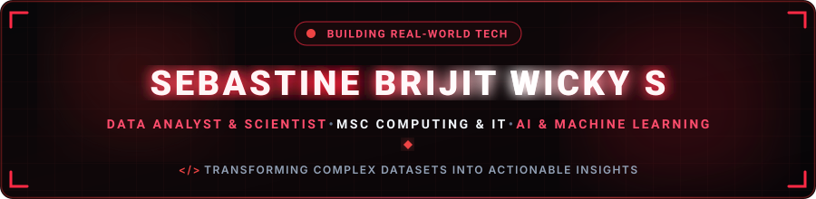

  

  

  
  &nbsp;
  
  &nbsp;
  
  &nbsp;
  

  

---

<h2 align="center">🔴 About Me</h2>

  

  

  Ambitious and technically skilled <b>Data Analyst</b> and <b>Data Scientist</b> with a strong foundation in <b>MSc Computing and IT</b> and a Bachelor's in <b>Electrical and Electronics Engineering</b>. Experienced in leveraging Python, Tableau, Power BI, Streamlit, and SQL to drive data-driven solutions through multiple internships and careers in Data Analytics, Data Science, Artificial Intelligence, and Machine Learning. Adept at transforming complex datasets into actionable insights and visualizations.

  
  &nbsp;
  
  &nbsp;
  
  &nbsp;
  

<table width="100%" border="0" align="center">
<tr>
<td width="50%" align="center" style="padding: 14px;">
  <h4>🎓 Postgraduate Education</h4>
  
<b>MSc Computing and IT</b> Cardiff Metropolitan University

</td>
<td width="50%" align="center" style="padding: 14px;">
  <h4>⚡ Undergraduate Degree</h4>
  
<b>B.E. Electrical &amp; Electronics</b> Meenakshi College of Engineering

</td>
</tr>
<tr>
<td width="50%" align="center" style="padding: 14px;">
  <h4>📍 Location</h4>
  
<b>Cardiff, Wales, UK</b> Open to Opportunities

</td>
<td width="50%" align="center" style="padding: 14px;">
  <h4>🎯 Specialization</h4>
  
<b>Data Analytics &amp; Machine Learning</b> Actionable Insights &amp; AI Agents

</td>
</tr>
</table>

---

<h2 align="center">🔴 Tech Stack & Skills</h2>

<b>Programming Languages</b>

  
  
  
  
  
  
  

<b>Frontend Development</b>

  
  
  
  
  

<b>Backend & Cloud Architecture</b>

  
  
  

<b>Databases & Data Stores</b>

  
  
  

<b>Data Science, Machine Learning & Analytics Tools</b>

  
  
  
  
  
  
  
  
  
  
  
  

---

<h2 align="center">🔴 Featured Projects</h2>

<table width="100%" border="0" align="center">
<tr>
<td width="50%" align="center" style="padding: 18px;">
  <h3>⚡ Grid-Aware LLM Energy Agent</h3>
  
<i>Intelligent LLM-driven energy optimization and grid-aware decision-making agent.</i>

</td>
<td width="50%" align="center" style="padding: 18px;">
  <h3>🌍 India Air Quality Analysis</h3>
  
<i>In-depth exploratory data analysis and predictive modeling for atmospheric air quality metrics.</i>

</td>
</tr>
<tr>
<td width="50%" align="center" style="padding: 18px;">
  <h3>📚 Smart Study Agent</h3>
  
<i>AI-powered study assistant facilitating personalized learning schedules and automated workflows.</i>

</td>
<td width="50%" align="center" style="padding: 18px;">
  <h3>🚶 Pedestrian Traffic &amp; Dry Bean Dataset</h3>
  
<i>Data analytics and machine learning classification exploring urban pedestrian patterns and dry bean characteristics.</i>

  

    
  

</td>
</tr>
<tr>
<td width="50%" align="center" style="padding: 18px;">
  <h3>💳 Big Data &amp; Personalisation in FinTech - Revolut</h3>
  
<i>Large-scale financial data processing and consumer personalisation analytics based on Revolut case study.</i>

</td>
<td width="50%" align="center" style="padding: 18px;">
  <h3>📊 AI Energy Meter</h3>
  
<i>Hardware and AI-assisted energy metering system for real-time electrical consumption tracking and analytics.</i>

</td>
</tr>
</table>

---

<h2 align="center">🔴 GitHub Analytics & Activity</h2>

  
  &nbsp;&nbsp;
  

  

---

<h2 align="center">🏆 GitHub Trophies</h2>

  

---

<h3 align="center">✍️ Random Dev Quote</h3>

  

---

  

